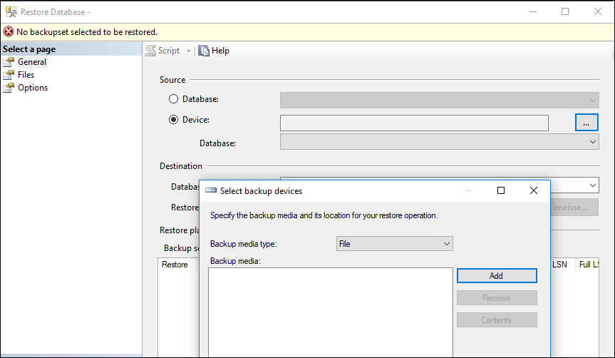
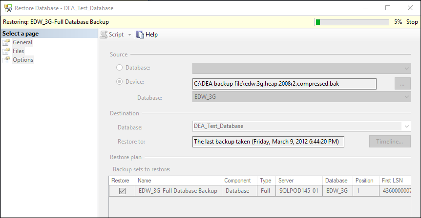

# Validate your workload(s) against Azure SQL database using Database Experimentation Assistant (DEA)

DEA supports A\B testing for SQL Server upgrades, migrations to Azure SQL database and Managed Instance. However, this document will focus on Azure SQL database only, for the purpose of Ready workshop.

Database Experimentation Assistant (DEA) is an A\B testing solution for migrations to Azure SQL database. You can use DEA to capture workloads on your source SQL Server instance and replay it on Azure SQL database target to compare performance and identify compatibility issues between the two platforms. 

In this tutorial you will learn how to use DEA to:
-	 Capture the workload from your source SQL Server instance.  
-	 Replay the workload on the target Azure SQL database.  
-	 Run analysis to compare the workload between your source and target databases.  
-	 Use the analysis reports to compare performance and compatibility between source and target databases.  

## Prerequisites 

To complete this tutorial, you need to  
1.  Download and Install Database Experimentation Assistant 2.6 on your laptop.  
2.  Bring your own source database that has queries running   
    or 
    Setup a source database on your laptop using the steps described below.  
    
To setup a test database on your laptop to use as source for this exercise:  
1.	Download the backup file located here.  
2.	Open SQL Server Management Studio.  
3.	Right click on Databases and select Restore Database.  
4.	In the pop-up, select Device and click on the … button.   
5.	In the select backup devices pop-up, click Add button.   

  
    
6.	In the locate backup file pop-up, select the backup file that you downloaded in step 1.  
7.	Once you select the file, click OK to come back to the main window.   
8.	In the main window, feel free to change the database name as needed and click ok again.  
9.	It will take a few minutes for the database to be created from the backup. You can see the progress in the right top corner of the window.  

    
  
    
10.	Once it is 100%, you will get a confirmation. Your database is now created.  
11.	The last step in setting up the source is using the exe file located here to create a workload.

    

